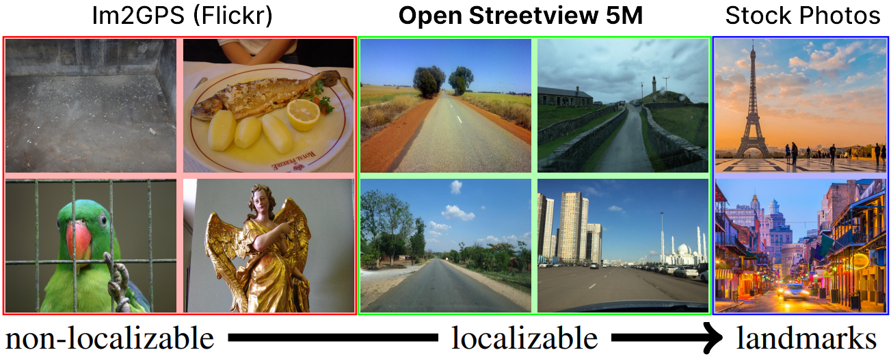
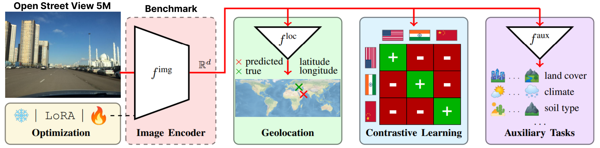

# OpenStreetView-5M <br><sub>The Many Roads to Global Visual Geolocation 📍🌍</sub>

Official PyTorch implementation of [OpenStreetView-5M: The Many Roads to Global Visual Geolocation](https://imagine.enpc.fr/~guillaume-astruc/osv-5m).  

**First authors:** [Guillaume Astruc](https://gastruc.github.io/), [Nicolas Dufour](https://nicolas-dufour.github.io/), [Ioannis Siglidis](https://imagine.enpc.fr/~siglidii/)  
**Second authors:** [Constantin Aronssohn](), Nacim Bouia, [Stephanie Fu](https://stephanie-fu.github.io/), [Romain Loiseau](https://romainloiseau.fr/), [Van Nguyen Nguyen](https://nv-nguyen.github.io/), [Charles Raude](https://imagine.enpc.fr/~raudec/), [Elliot Vincent](https://imagine.enpc.fr/~vincente/), Lintao XU, Hongyu Zhou  
**Last author:** [Loic Landrieu](https://loiclandrieu.com/)  
**Research Institute:** [Imagine](https://imagine.enpc.fr/), _LIGM, Ecole des Ponts, Univ Gustave Eiffel, CNRS, Marne-la-Vallée, France_  

## Introduction 🌍
OpenStreetView-5M is the first large-scale open geolocation benchmark of streetview images.  
To get a sense of the difficulty of the benchmark, you can play our [demo](https://huggingface.co/spaces/osv5m/plonk).  
Our dataset was used in an extensive benchmark of which we provide the best model.  
For more details and results, please check out our [paper](arxiv) and [project page](https://imagine.enpc.fr/~guillaume-astruc/osv-5m).  

### Dataset 💾
OpenStreetView-5M is hosted at [huggingface/datasets/osv5m/osv5m](https://huggingface.co/datasets/osv5m/osv5m). To download and extract it run:
```bash
python scripts/download-dataset.py
``` 
For different ways of importing the dataset see [DATASET.md](DATASET.md) 

### Inference 🔥
Our best model on OSV-5M can also be found on [huggingface](https://huggingface.co/osv5m/baseline).  

```bash
from PIL import Image
from models.huggingface import Geolocalizer

geolocalizer = Geolocalizer.from_pretrained('osv5m/baseline')
img = Image.open('.media/examples/img1.jpeg')
x = geolocalizer.transform(img).unsqueeze(0) # transform the image using our dedicated transformer
gps = geolocalizer(x) # B, 2 (lat, lon - tensor in rad)
```

To reproduce results for the model on [huggingface](https://huggingface.co/osv5m/baseline), run:

```bash
python evaluation.py exp=eval_best_model dataset.global_batch_size=1024
```

## Benchmark 🛰️

To replicate all the the experiments of our paper, we provide dedicated scripts in `scripts/experiments`.

### Installation 🌱
To install our conda environment, run:

```bash
conda env create -f environment.yaml
conda activate osv5m
```

### Replication 🛠️

To run most methods, you first need to precompute the QuadTrees (roughly 10 minutes):

```bash
python scripts/preprocessing/preprocess.py data_dir=datasets do_split=1000 #You will need to run this code with other splitting/depth arguments if you want to use different quadtree arguments
```

Use the configs/exp folder to select the experiment you want. Feel free to explore it. All evaluated models from the paper have a dedicated config file

```bash
# Using more workers in the dataloader
computer.num_workers=20

#Change number of devices available
computer.devices=1

#Change batch_size distributed to all devices
dataset.global_batch_size=2

#Changing mode train or eval, default is train
mode=eval

# All these parameters and more can be changed from the config file!

# train best model
python train.py exp=best_model computer.devices=1 computer.num_workers=16 dataset.global_batch_size=2
``` 

### Citing 💫

```bibtex
@article{osv5m,
    title = {{OpenStreetView-5M}: {T}he Many Roads to Global Visual Geolocation},
    author = {Astruc, Guillaume and Dufour, Nicolas and Siglidis, Ioannis
      and Aronssohn, Constantin and Bouia, Nacim and Fu, Stephanie and Loiseau, Romain
      and Nguyen, Van Nguyen and Raude, Charles and Vincent, Elliot and Xu, Lintao
      and Zhou, Hongyu and Landrieu, Loic},
    journal = {CVPR},
    year = {2024},
  }
```
